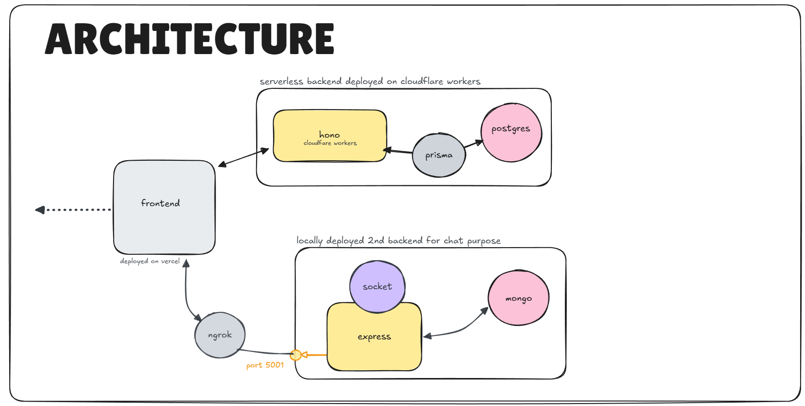

# System Architecture

Nirvana is built using a carefully designed **microservices architecture** that emphasizes **separation of concerns, scalability, and performance**, ensuring that each part of the system is optimized for its specific workload.

---

## System Overview

---

## Client Layer

At the client layer, the frontend application is developed using **React with TypeScript** and powered by **Vite**, providing a fast development experience and highly optimized production builds.

This frontend is responsible for **rendering the user interface**, **handling routing and user interactions**, **managing client-side state**, and **communicating with backend services** through both HTTP and WebSocket connections.

**Zustand** is used specifically for managing **real-time chat state**, while **Axios** handles REST-based communication with backend APIs and the **Socket.IO client** maintains persistent connections for live messaging features.

**Tailwind CSS** is used to maintain a consistent, utility-first styling approach across the application, allowing rapid UI development while keeping the codebase clean and maintainable.

---

## Backend Architecture

On the backend, Nirvana is divided into **two primary services**, each serving a distinct purpose.

---

### Edge API Service

The first is a **Cloudflare Workers–based backend** that acts as the **core API layer** for the platform. This service is built using the **Hono framework**, chosen for its minimal overhead, fast execution, and strong compatibility with edge environments.

Running on **Cloudflare’s global edge network**, this backend ensures **low-latency responses** by executing close to the end user, making it ideal for **read-heavy and latency-sensitive operations** such as fetching blog posts, handling user authentication, and serving content feeds.

It manages **user authentication and authorization using JWTs**, performs **full CRUD operations on blogs**, coordinates **image uploads through Cloudinary**, supports **blog search and filtering**, and interacts with a **PostgreSQL database using Prisma ORM**.

A critical architectural decision here is the use of **Prisma Accelerate** for database access, which enables **efficient connection pooling in a serverless environment**.

Since **Cloudflare Workers do not support long-lived TCP connections**, traditional database connection pooling is not feasible.

Prisma Accelerate solves this by introducing a **global, managed connection pool** that sits between the Workers runtime and the PostgreSQL server, reusing a limited number of persistent connections across requests.

This prevents **connection exhaustion**, reduces **cold-start latency**, and ensures **stable performance under high concurrency**, while also enabling **edge-safe database access** without violating serverless constraints.

## 

### Real-Time Service

The second backend service is a **traditional Node.js server built with Express**, dedicated entirely to **real-time communication and user presence features**.

This service maintains **persistent WebSocket connections using Socket.IO**, making it suitable for features that require **continuous, bidirectional communication** such as live chat, typing indicators, and online status tracking.

Unlike the serverless backend, this service runs in a **stateful environment**, allowing it to efficiently manage **socket connections and in-memory session data**.

It handles **authentication for chat interactions using JWTs**, securely manages **user credentials with bcrypt**, persists **chat messages and conversation history in MongoDB**, tracks **online users in real time**, and supports **profile updates** that need immediate propagation to connected clients.

**MongoDB** is intentionally chosen here due to its **flexible document schema** and **high write throughput**, which align well with the unpredictable structure and frequency of real-time chat messages.

---

## Data Layer

At the data layer, Nirvana employs a **polyglot persistence strategy** by using both **PostgreSQL and MongoDB**, selecting each database based on the nature of the data it stores.

**PostgreSQL**, accessed via Prisma from the Hono backend, is used for **structured, relational data** such as users, blogs, locations, and authentication records.

It benefits from **strong consistency guarantees**, **relational constraints**, and **ACID compliance** for critical operations.

**MongoDB**, accessed via Mongoose from the Express backend, stores **chat messages and conversation metadata**.

It enables **rapid inserts**, **flexible schema evolution**, and **efficient querying of message threads**.

This dual-database approach allows the platform to **scale each data store independently** while ensuring that each subsystem uses the database technology **best suited to its access patterns**.

Ultimately, this results in a system that is **robust, scalable, and optimized** for both **content delivery and real-time interaction**.

---

## Request Flow

### Blog feed fetch (step-by-step)

This describes the standard “blog feed” read path (for example, a paginated list).

1. **Frontend** triggers a feed request (initial page load, pagination, refresh).
2. **Frontend → Edge API** sends an HTTP `GET` request to the Cloudflare Workers API, typically:
   - `GET /api/v1/blog/paginated_bulk?page=<page>&limit=<limit>` (or `GET /api/v1/blog/bulk` for non-paginated).
3. **Frontend → Edge API (auth)** includes the JWT in `Authorization: Bearer <jwt>`.
4. **Edge API (Cloudflare Workers / Hono)** routes the request to the blog router and executes JWT verification middleware.
5. **Edge API → Database access layer** creates a Prisma Client (edge) instance and extends it with Prisma Accelerate.
6. **Prisma (via Accelerate) → PostgreSQL** performs the query (for the feed endpoints this is a `findMany` including `author` and `location`, plus pagination and ordering where applicable).
7. **PostgreSQL → Prisma → Edge API** returns the result rows.
8. **Edge API → Frontend** returns a JSON response containing the blogs (and pagination metadata when using the paginated route).
9. **Frontend** updates state and renders the feed UI.

This is an explicit **frontend → backend → database → response** flow, optimized for low latency by running the API at the edge and using Prisma Accelerate to avoid connection-pool exhaustion in serverless execution.

### Real-time chat message send/receive (step-by-step)

The real-time experience is implemented using two coordinated paths: **HTTP for persistence** and **WebSocket for delivery/presence**.

**Send path**

1. **Frontend** collects the outgoing message (text and optional image).
2. **Frontend → Real-time Service (Express)** sends an authenticated HTTP request:
   - `POST /api/messages/send/:id`
3. **Frontend → Real-time Service (auth)** relies on the `jwt` cookie (HTTP-only) being sent with the request.
4. **Real-time Service (Express)** runs `protectRoute` middleware:
   - Extracts `req.cookies.jwt`
   - Verifies the token using `JWT_SECRET`
   - Loads the user record (and attaches it to `req.user`)
5. **Real-time Service → MongoDB** validates that the receiver is a “friend”, then writes the new message document.
6. **Real-time Service → Cloudinary (optional)** if an image is provided, uploads it and stores the resulting URL in the message.
7. **Real-time Service → Frontend (sender)** returns `201` with the persisted message payload.

**Receive path (real-time delivery)**

1. **Receiver Frontend ↔ Real-time Service** maintains a Socket.IO connection (WebSocket) for presence and live delivery.
2. **Real-time Service** maps `userId → socketId` using the Socket.IO handshake query and keeps an in-memory `userSocketMap` for currently online users.
3. When a message is persisted, the **Real-time Service** looks up the receiver’s active socket and emits `newMessage` to that socket.
4. **Receiver Frontend** receives the `newMessage` event and updates local chat state (Zustand), rendering the message immediately.
5. **Presence updates** are broadcast using the `getOnlineUsers` event whenever users connect or disconnect.

This is an explicit **frontend → backend → database → response** flow for persistence, combined with **backend → WebSocket event → frontend** for low-latency delivery.

---

## Deployment Architecture

### Development deployment

In development, services are typically run independently and communicate over local URLs:

- **Frontend** runs via Vite dev server (commonly `http://localhost:5173`).
- **Edge API Service** runs via `wrangler dev`, exposing the Workers API on a local development URL.
- **Real-time Service** runs via `nodemon` (Express + Socket.IO), commonly on `http://localhost:5001`.

**Role of ngrok**

The real-time service code includes permissive CORS logic explicitly noted as “Allow all for ngrok testing”. In this system, **ngrok is used to expose the locally running Express real-time service (port 5001) to the public internet**, and the **frontend calls the ngrok URL** to reach the chat backend.

This is currently used in:

- **Development**: local Express server on `http://localhost:5001`, exposed via an ngrok public URL for cross-network testing.
- **Production (current state)**: the Express server is still running locally and is **not deployed to a managed hosting provider** (e.g., Render). The production frontend reaches the chat backend through the **ngrok public URL**.

Operationally, this means ngrok is functioning as the public ingress for the real-time service in both environments.

### Production deployment

In production, each component is deployed using the platform most suited to its workload:

- **Frontend** is deployed as a static/web app build (for example, on Vercel as indicated by the frontend configuration).
- **Edge API Service** is deployed to Cloudflare Workers using Wrangler (`wrangler deploy`).

**Real-time Service (current state)**

- The Express + Socket.IO real-time service is **not deployed** to a dedicated hosting platform.
- It runs locally on port `5001` and is exposed to the public internet using **ngrok**, and the frontend is configured to call that ngrok URL.

This keeps the architecture intact (separate real-time service), but the deployment model for the real-time service is currently “local + ngrok” rather than “managed hosting”.

Operationally, production requires:

- Correct **CORS allowlists** for the production frontend origin.
- Consistent **environment variables** across services (`JWT_SECRET`, database connection strings, and Cloudinary credentials).
- **HTTPS** for all public endpoints (required for secure cookies when `sameSite="none"`).

---

## Scalability and Fault Isolation

### Independent scaling

- **Edge API Service (Cloudflare Workers)** scales horizontally by default. Cloudflare automatically runs more isolates as request volume increases, and the service benefits from global edge placement for latency.
- **Real-time Service (Express + Socket.IO)** scales independently from the Edge API. It can be scaled by running multiple instances behind a load balancer; however, Socket.IO deployments typically require connection affinity (sticky sessions) and/or an adapter (for example Redis) to share presence and message delivery across instances.

### Fault isolation behavior

The split-service architecture intentionally limits blast radius:

- If the **Real-time Service** is degraded or unavailable, **blogging and content APIs remain available** through the Edge API Service. Users may lose chat/presence features but can still browse and publish blogs.
- If the **Edge API Service** is degraded or unavailable, **real-time chat can remain operational** (Socket.IO presence and message delivery), but content operations (blog feed, blog CRUD, image upload coordination via the API) will fail.

### Prisma Accelerate during traffic spikes

Prisma Accelerate materially improves resilience for the Edge API during spikes by providing a managed, shared connection pool between serverless Workers and PostgreSQL. This reduces the likelihood of:

- PostgreSQL connection exhaustion from many concurrent serverless requests
- Increased tail latency caused by repeated connection establishment

---

## Security Architecture

### JWT issuance and verification boundaries

The system uses JWTs in two distinct ways, aligned to the responsibilities of each backend:

- **Edge API Service (Cloudflare Workers / Hono)** issues JWTs on sign-in/sign-up and returns them in the response body (for example `{ "jwt": "..." }`). Clients authenticate by sending `Authorization: Bearer <jwt>` on subsequent requests.
- **Real-time Service (Express)** issues JWTs and stores them in an **HTTP-only cookie** named `jwt`. Protected endpoints authenticate by reading `req.cookies.jwt`.

These are separate verification boundaries: each service verifies tokens using its own middleware and secret configuration. The client must send credentials in the form expected by the target service.

### Authentication differences: API service vs real-time service

- **Edge API Service**: header-based auth (`Authorization`), stateless, designed for serverless request/response handling.
- **Real-time Service**: cookie-based auth for HTTP routes, plus a persistent Socket.IO connection for presence and live delivery.

### Password handling (high level)

At a high level, authentication relies on credentials stored in the respective data stores. In the current implementation, password comparison logic is present in both services. For production-grade security, password storage should be handled using a strong one-way hashing algorithm and secure comparison (the document does not change this design decision; it records the requirement as an operational security expectation).

### Transport security (high level)

- Production traffic should be served over **HTTPS** end-to-end.
- The real-time service uses **HTTP-only cookies** and sets `secure: true` when issuing JWT cookies, which requires HTTPS.
- CORS policies should be tightened to the known frontend origins in production to reduce cross-origin exposure.
